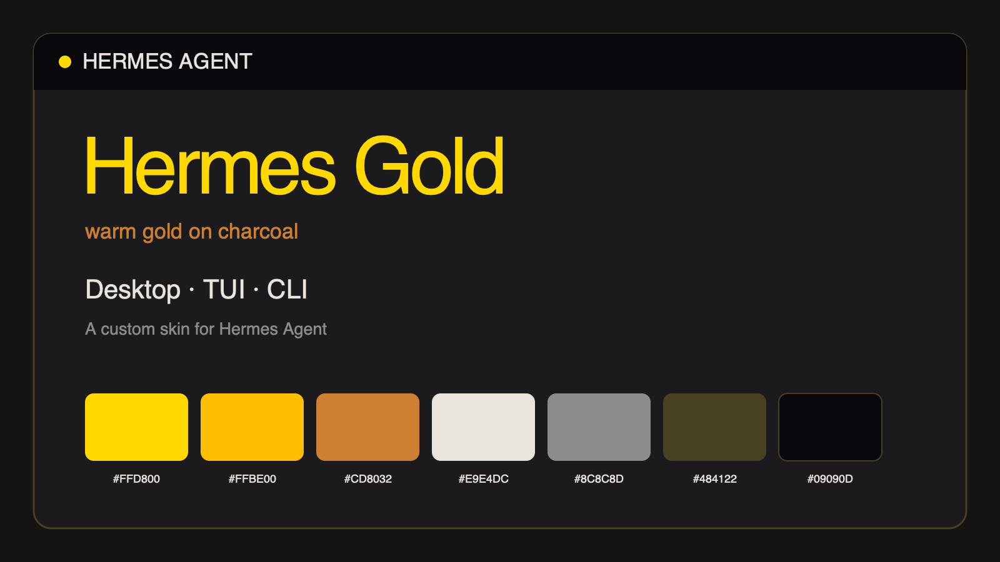
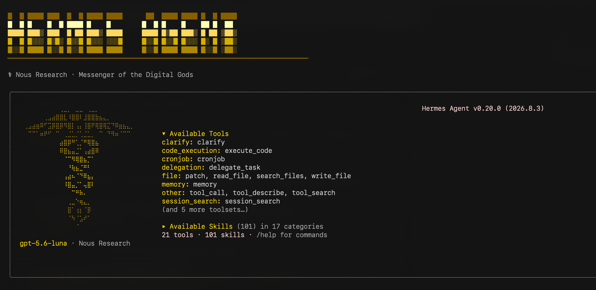

# Hermes Gold



A warm gold-on-charcoal theme for [Hermes Agent](https://github.com/NousResearch/hermes-agent). It provides coordinated colors across the **native desktop app, TUI, CLI, and web dashboard**, plus a custom pixel-art **HERMES / AGENT** banner logo.

## TUI preview

Hermes Gold applied to the native Hermes Agent TUI:



*Captured with Hermes Agent v0.20.0 (2026.8.3); shows the terminal-safe metallic wordmark treatment.*

## Palette

| Role | Color |
| --- | --- |
| Canvas | `#141414` |
| Elevated surface | `#1B1B1D` |
| Header and code background | `#09090D` |
| Primary gold | `#FFD800` |
| Secondary amber | `#FFBE00` |
| Bronze | `#CD8032` |
| Primary text | `#E9E4DC` |
| Muted text | `#8C8C8D` |
| Borders | `#484122` |

## How Hermes theming is split

Hermes uses separate theme systems for its native interfaces and web dashboard:

| Source file | Install location | Config key | Applies to |
| --- | --- | --- | --- |
| [`hermes-gold.yaml`](hermes-gold.yaml) | `$HERMES_HOME/skins/hermes-gold.yaml` | `display.skin` | CLI, TUI, and native desktop app |
| [`hermes-gold-dashboard.yaml`](hermes-gold-dashboard.yaml) | `$HERMES_HOME/dashboard-themes/hermes-gold.yaml` | `dashboard.theme` | Web dashboard shell |

The web dashboard's embedded chat still honors `display.skin`; its surrounding navigation, panels, and controls use `dashboard.theme`. The two files intentionally use different schemas.

## Install

Hermes Agent must already be installed. The dashboard companion has been verified with Hermes Agent v0.19.1.

```bash
export HERMES_HOME="${HERMES_HOME:-$HOME/.hermes}"
mkdir -p "$HERMES_HOME/skins" "$HERMES_HOME/dashboard-themes"

curl -fsSL \
  https://raw.githubusercontent.com/zachvivier/desktop-theme-hermes-gold/main/hermes-gold.yaml \
  -o "$HERMES_HOME/skins/hermes-gold.yaml"

curl -fsSL \
  https://raw.githubusercontent.com/zachvivier/desktop-theme-hermes-gold/main/hermes-gold-dashboard.yaml \
  -o "$HERMES_HOME/dashboard-themes/hermes-gold.yaml"

hermes config set display.skin hermes-gold
hermes config set dashboard.theme hermes-gold
```

The CLI, TUI, and native desktop app should repaint automatically. Refresh the web dashboard after selecting the dashboard theme.

You may install only one file if you only want Hermes Gold on the native interfaces or only on the dashboard.

## Verify

```bash
hermes config get display.skin
hermes config get dashboard.theme
hermes config check
```

The first two commands should both return `hermes-gold`. The web dashboard's theme picker should also show **Hermes Gold** as active.

## Update

Run both download commands again, then reselect the themes if needed:

```bash
export HERMES_HOME="${HERMES_HOME:-$HOME/.hermes}"

curl -fsSL \
  https://raw.githubusercontent.com/zachvivier/desktop-theme-hermes-gold/main/hermes-gold.yaml \
  -o "$HERMES_HOME/skins/hermes-gold.yaml"

curl -fsSL \
  https://raw.githubusercontent.com/zachvivier/desktop-theme-hermes-gold/main/hermes-gold-dashboard.yaml \
  -o "$HERMES_HOME/dashboard-themes/hermes-gold.yaml"

hermes config set display.skin hermes-gold
hermes config set dashboard.theme hermes-gold
```

## Revert or uninstall

```bash
export HERMES_HOME="${HERMES_HOME:-$HOME/.hermes}"

hermes config set display.skin default
hermes config set dashboard.theme default-large

rm -f "$HERMES_HOME/skins/hermes-gold.yaml"
rm -f "$HERMES_HOME/dashboard-themes/hermes-gold.yaml"
```

## Customize

With `hermes-gold` active, change one native-interface token without replacing the rest of the palette:

```bash
hermes skin set ui_accent "#FFD800"
```

For dashboard changes, edit the installed `dashboard-themes/hermes-gold.yaml` companion and refresh the dashboard. Do not copy the skin YAML into the dashboard-themes directory—the schemas are different.

## License

MIT
